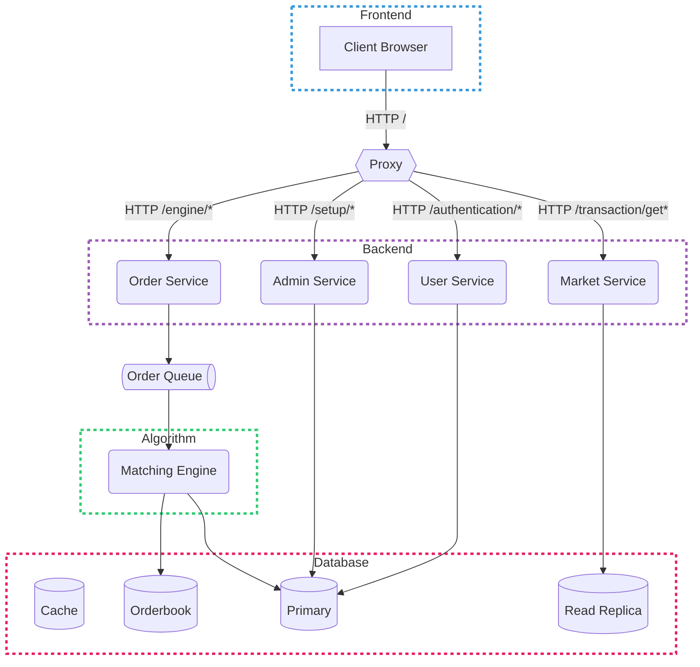

# UVic Trades

```mermaid
flowchart TD
    subgraph frontend_rect["Frontend"]
        CB[Client Browser]
    end

    P{{Proxy}}
    CB -->|HTTP /| P

    subgraph backend_rect["Backend"]
    direction LR
        OS(Order Service)
        US(User Service)
        MS(Market Service)
        AS(Admin Service)
    end
    P -->|HTTP /authentication/*| US
    P -->|HTTP /engine/*| OS
    P -->|HTTP /transaction/get*| MS
    P -->|HTTP /setup/*| AS

    Q@{ shape: das, label: "Order Queue" }
    OS --> Q

    subgraph algo_rect["Algorithm"]
        M(Matching Engine)
    end

    Q --> M

    subgraph db_rect["Database"]
    direction LR
        C[(Cache)]
        OB[(Orderbook)]
        DB[(Primary)]
        DBR[(Read Replica)]
    end

    US & AS--> DB
    MS --> DBR
    M --> DB & OB


    style db_rect       stroke:#e91e63,stroke-width:3px,fill:none,stroke-dasharray:4,4
    style backend_rect  stroke:#9b59b6,stroke-width:3px,fill:none,stroke-dasharray:4,4
    style algo_rect     stroke:#2ecc71,stroke-width:3px,fill:none,stroke-dasharray:4,4
    style frontend_rect stroke:#3498db,stroke-width:3px,fill:none,stroke-dasharray:4,4
```
