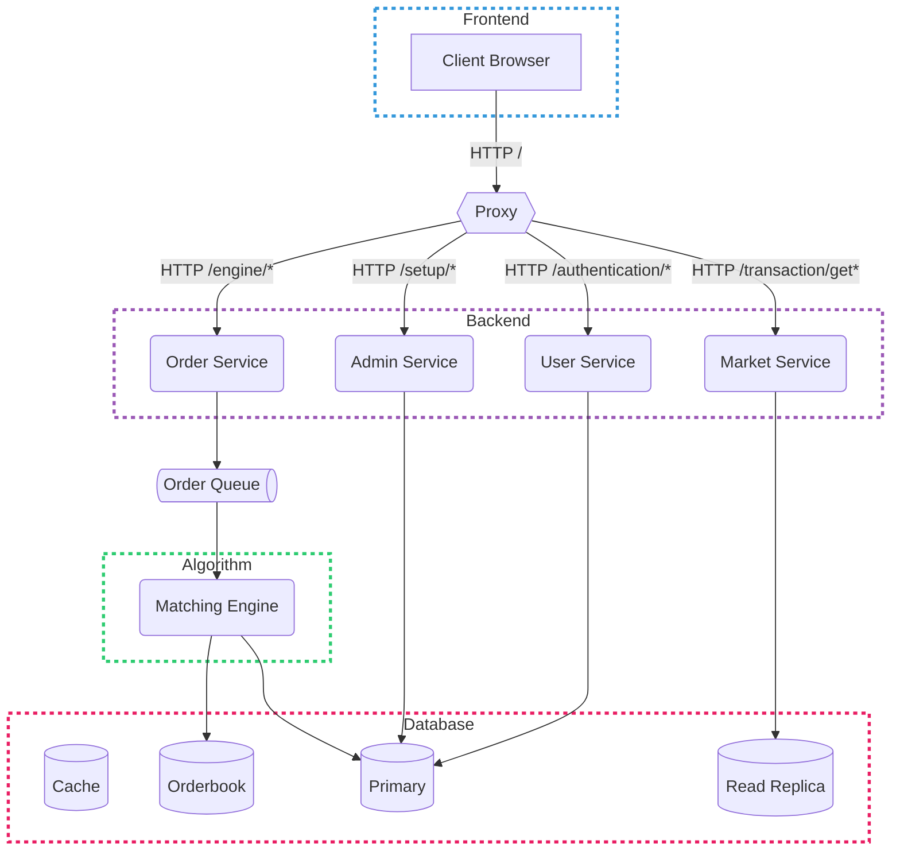

# UVic Trades

## Local Development

> [!NOTE]
> **BEFORE** you run the following steps make sure you have [`docker`](https://docs.docker.com/engine/install/) & the [`docker compose`](https://docs.docker.com/compose/install/#scenario-two-install-the-compose-plugin) plugin installed and running

```shell
# Clone the repository
git clone https://github.com/UVicTrades/trades && cd trades

# Run the docker compose stack with hot reloading
docker compose up --build --wait

# View all container logs
docker compose logs -f

# When you want to shut it down
docker compose down -v
```

The development environment is now running (give it ~1min to spin up) and accessible at [http://localhost/](http://localhost/)

## System Architecture


